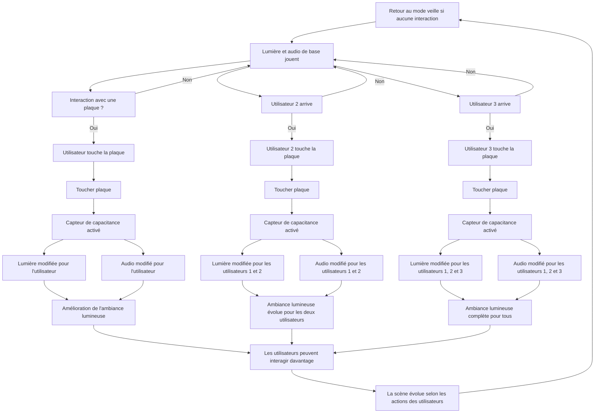

# Scénario

## Scénario interactif

```mermaid
graph TD;

    %% Etape 1 : Mode veille avec ambiance de base
    ModeVeille[Mode veille] --> AmbianceBase[Lumière et audio de base jouent]
    AmbianceBase --> Interaction[Interaction avec une plaque ?]

    %% Utilisateur 1 : Si l'utilisateur interagit avec la plaque
    Interaction -- Oui --> Plaque1[Utilisateur touche la plaque]
    Plaque1 --> ActionPlaque1[Toucher plaque]
    ActionPlaque1 --> Capteur1[Capteur de capacitance activé]
    Capteur1 --> Lumière1[Lumière modifiée pour l'utilisateur]
    Capteur1 --> Audio1[Audio modifié pour l'utilisateur]
    Lumière1 --> Progression1[Amélioration de l'ambiance lumineuse]
    Audio1 --> Progression1

    %% Retour à l'ambiance de base si l'utilisateur ne touche pas la plaque
    Interaction -- Non --> AmbianceBase;

    %% Extension pour les utilisateurs suivants
    %% Utilisateur 2 : Si l'utilisateur 2 interagit avec la plaque
    AmbianceBase --> Interaction2[Utilisateur 2 arrive]
    Interaction2 -- Oui --> Plaque2[Utilisateur 2 touche la plaque]
    Plaque2 --> ActionPlaque2[Toucher plaque]
    ActionPlaque2 --> Capteur2[Capteur de capacitance activé]
    Capteur2 --> Lumière2[Lumière modifiée pour les utilisateurs 1 et 2]
    Capteur2 --> Audio2[Audio modifié pour les utilisateurs 1 et 2]
    Lumière2 --> Progression2[Ambiance lumineuse évolue pour les deux utilisateurs]
    Audio2 --> Progression2

    %% Retour à l'ambiance de base si l'utilisateur 2 ne touche pas la plaque
    Interaction2 -- Non --> AmbianceBase;

    %% Utilisateur 3 : Si l'utilisateur 3 interagit avec la plaque
    AmbianceBase --> Interaction3[Utilisateur 3 arrive]
    Interaction3 -- Oui --> Plaque3[Utilisateur 3 touche la plaque]
    Plaque3 --> ActionPlaque3[Toucher plaque]
    ActionPlaque3 --> Capteur3[Capteur de capacitance activé]
    Capteur3 --> Lumière3[Lumière modifiée pour les utilisateurs 1, 2 et 3]
    Capteur3 --> Audio3[Audio modifié pour les utilisateurs 1, 2 et 3]
    Lumière3 --> Progression3[Ambiance lumineuse complète pour tous]
    Audio3 --> Progression3

    %% Retour à l'ambiance de base si l'utilisateur 3 ne touche pas la plaque
    Interaction3 -- Non --> AmbianceBase;

    %% Actions émergentes
    Progression1 --> InteractionActive[Les utilisateurs peuvent interagir davantage]
    Progression2 --> InteractionActive
    Progression3 --> InteractionActive

    %% Faire progresser l'expérience
    InteractionActive --> NouvelleExpérience[La scène évolue selon les actions des utilisateurs]
    NouvelleExpérience --> ModeVeille[Retour au mode veille si aucune interaction]


```
### Schéma spécifique

