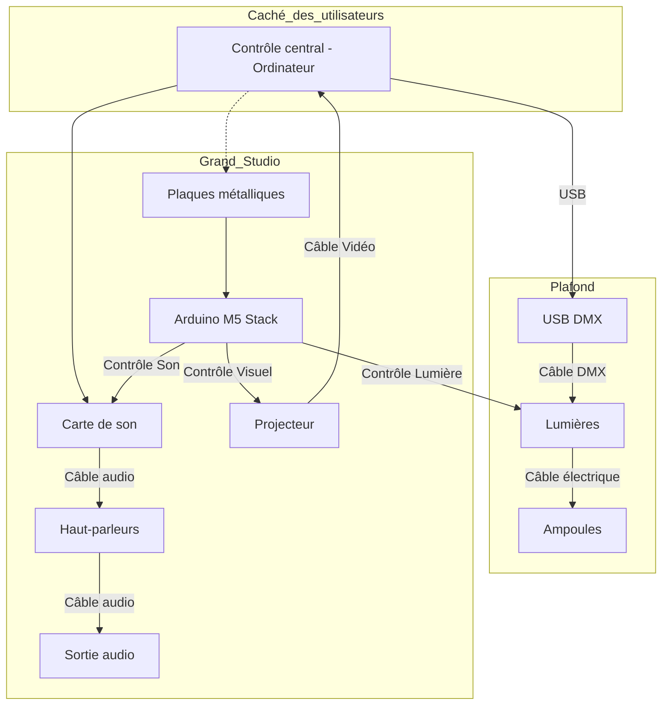

# Synoptique

```mermaid
graph TD;  
  %% Composants     
  Ordinateur["Contrôle central - Ordinateur"]     
  DMX["USB DMX"]     
  Lumieres["Lumières"]     
  Ampoule["Ampoules"]     
  CarteSon["Carte de son"]     
  HautParleur["Haut-parleurs"]     
  SortieAudio["Sortie audio"]      
  PlaqueMetalique["Plaques métalliques"]     
  Arduino["Arduino M5 Stack"]     
  Projecteur["Projecteur"]   
  
  %% Emplacements     
  subgraph Caché_des_utilisateurs         
    Ordinateur     
  end     
  subgraph Plafond         
    DMX         
    Lumieres         
    Ampoule     
  end     
  subgraph Grand_Studio         
    PlaqueMetalique         
    Arduino     
    Projecteur  
    CarteSon
    HautParleur
    SortieAudio
  end     
  
  %% Connexions     
  Ordinateur -->|USB| DMX     
  Ordinateur --> CarteSon     
  Ordinateur -.-> PlaqueMetalique     
  PlaqueMetalique --> Arduino     
  Arduino -->|Contrôle Lumière| Lumieres     
  Arduino -->|Contrôle Son| CarteSon     
  Arduino -->|Contrôle Visuel| Projecteur 
  DMX -->|Câble DMX| Lumieres     
  Lumieres -->|Câble électrique| Ampoule     
  CarteSon -->|Câble audio| HautParleur     
  HautParleur -->|Câble audio| SortieAudio  
  Projecteur -->|Câble Vidéo| Ordinateur

```
