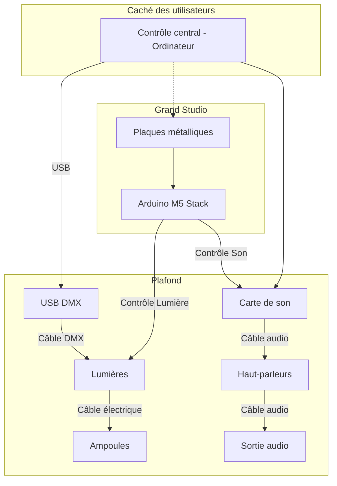

# Synoptique

```mermaid
graph TD;

%% Composants
    Ordinateur[Contrôle central - Ordinateur]
    DMX[USB DMX]
    Lumieres[Lumières]
    Ampoule[Ampoules]
    CarteSon[Carte de son]
    HautParleur[Haut-parleurs]
    SortieAudio[Sortie audio]

    PlaqueMetalique[Plaques métalliques]
    Arduino[Arduino M5 Stack]

    %% Emplacements
    subgraph Caché des utilisateurs
        Ordinateur
    end

    subgraph Plafond
        DMX
        Lumieres
        Ampoule 
        CarteSon
        HautParleur
        SortieAudio
    end

    subgraph Grand Studio
        PlaqueMetalique
        Arduino
    end

    %% Connexions
    Ordinateur -->|USB| DMX
    Ordinateur --> CarteSon
    Ordinateur -.-> PlaqueMetalique
    PlaqueMetalique --> Arduino
    Arduino -->|Contrôle Lumière| Lumieres
    Arduino -->|Contrôle Son| CarteSon
    DMX -->|Câble DMX| Lumieres
    Lumieres -->|Câble électrique| Ampoule
    CarteSon -->|Câble audio| HautParleur
    HautParleur -->|Câble audio| SortieAudio

```
