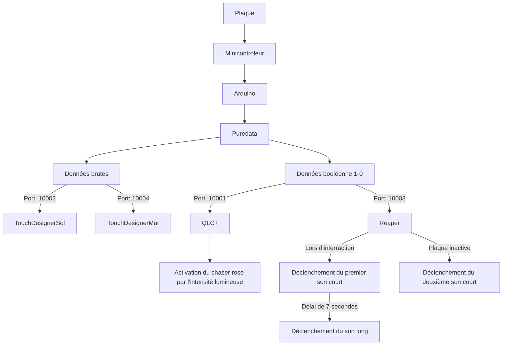

# Maquette
Documentation de la maquette, son fonctionnement, ce qu'elle teste et le résultat de ce test

La maquette de Luminatura a été élaborée pour offrir une **interaction minimale** avec **un seul utilisateur**. Dans ce contexte, on n'utilise qu'une seule plaque pour recevoir les données de la capacitance. À partir de celles-ci, une expérience visuelle, lumineuse et sonore sera créée.

## Composantes essentielles
### Interface utilisateur
* La plaque et son support
* La projection sur le sol
* La projection sur le mur
* L'écairage dans les 3 fleurs
* L'ambiance sonore

### Matériel et Capteurs
**Lié à la capacitance**
* 1 plaque en acier
* 1 minicontrôleur
* 1 trépied
* 2 supports imprimés en 3D
  
**Lié à l'audio**
* 1 haut-parleur

**Suspension et structure centrale**
* Quelques vignes
* 2 lanternes
* 3 fleurs (tissus blanc et jaune ainsi que des fils métalliques)
* Câble métallique en acier inoxydable
* Serre-câbles
* 3 poteaux
* 6 clamps doubles Pro Burger

**Lié à l'éclairage**
* 3 ampoules LED
* 1 transmetteur
* 3 extension pour les lumières

**Lié à la projection**
* 2 projecteurs

**Lié à la gestion**
* 2 ordinateurs

### Logiciel et Scripts
Arduino

* 
* 
* 

Puredata

Reaper (plugdata)

QLC+

## Gestion des données et des logiciels

### Gestion des logiciels sur deux ordinateurs
Ordinateur 1:
* QLC+
* Reaper
* Projection au mur

Ordinateur 2:
* Arduino
* Puredata
* Projection au sol

### Les différents ports utilisés
| Port  |  Fonction |
|---|---|
| 10001  | Qlc+  |
| 10002  | TouchDesigner - projection sur le sol  |
| 10003  | Reaper  |
| 10004  | TouchDesigner - projection sur le mur  |

## Les différents prototypes

#### Les fleurs
| Prototype 1  |  Prototype 2 | Prototype 03  | Fleur finale |
|---|---|---|---|
|   |   |    |    |

#### La plaque métallique
| Prototype 1  |  Prototype 2 | Prototype 3  |   Plaque finale   |
|---|---|---|---|
|   |   |    |  |

## Fonctionnement
### Flux de données et d’interactions
À la base de la maquette, Arduino aquiert les différentes valeurs de la capacitance et les transmet à Puredata. Dans puredata, les données brutes de la capacitance ainsi qu'un booléen 1/0 permettant d'identifier le moment de l'interaction sont utilisés et modifiés. Ces deux données permettent d'affecter l'éclairage des fleurs, l'audio et les deux projections. Celles-ci sont ensuite acheminées à Reaper, Qlc+ et TouchDesigner par l'attribution de ports spécifiques.

### Mode d'emploi des lumières
#### Association des lumières
*Associer les lumières une à la fois

*Un channel par lumière

Choisir un channel spécifique et allumer la lumière. Dans les 10 prochaines secondes, cliquer trois fois sur le bouton set du transmetteur. La lumière devrait clignoter 3 fois en vert pour démontrer son association.

Pour une seconde lumière, éteindre la première lumière déjà associée et changer de channel sur le transmetteur. Maintenant, allumer la deuxième lumière et refaire le même processus que fait précédemment sur la première lumière.

#### Disassociation des lumières
Éteindre les lumières et les rallumer. Dans les 5 prochaines secondes, appuyer 5 fois sur le bouton set du transmetteur. Les lumières devraient clignoter 10 fois en rouge pour démontrer leur dissociation du transmetteur.

## Gallerie d'images

* 
* 
* 
* 

## Vidéo du la maquette en action

<iframe width="560" height="315" src="https://www.youtube.com/embed/9Ty8B9qVx1c" title="YouTube video player" frameborder="0" allow="accelerometer; autoplay; clipboard-write; encrypted-media; gyroscope; picture-in-picture" referrerpolicy="strict-origin-when-cross-origin" allowfullscreen></iframe>
