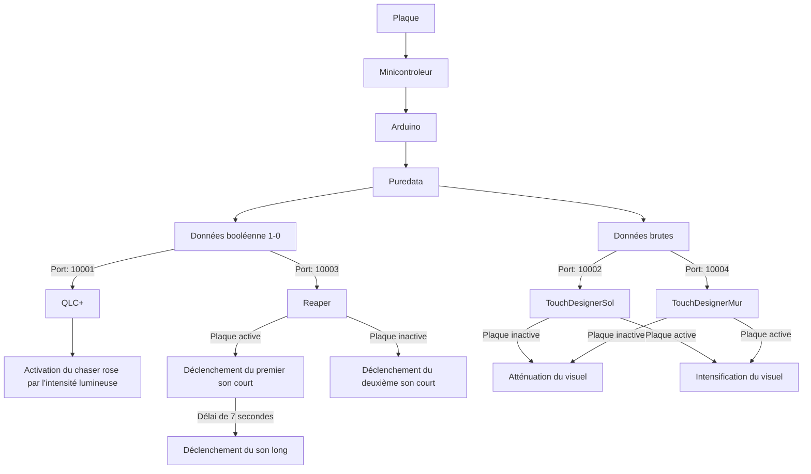
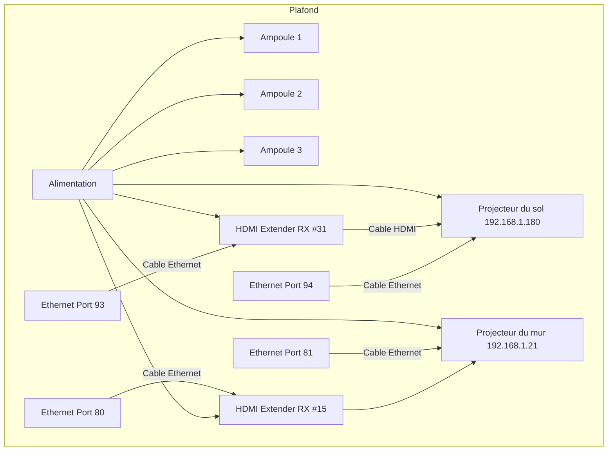
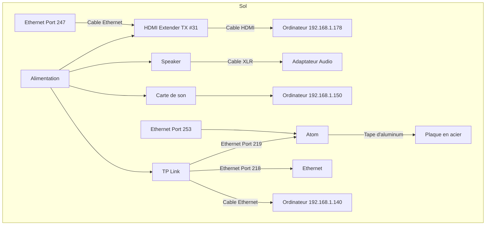
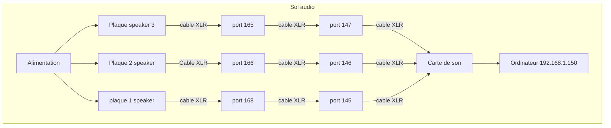

# Maquette

La maquette de Luminatura a été élaborée pour offrir une **interaction minimale** avec **un seul utilisateur**. Dans ce contexte, on n'utilise qu'une seule plaque pour recevoir les données de la capacitance. À partir de celles-ci, une expérience visuelle, lumineuse et sonore sera créée.

## Composantes essentielles de la maquette
### Interface utilisateur
* La plaque en acier
* Le support (support des hauts-parleurs)
* La projection sur le sol 
* La projection sur le mur
* L'écairage dans les 3 fleurs
* L'ambiance sonore
* Effets sonores

### Matériel et Capteurs
**Lié à la capacitance**
* 1 plaque en acier
* 1 minicontrôleur Atom M5
* 3 résisteurs
* 1 Cable Ethernet
* 1 Ruban adhésif métalique
* 1 Cable en acier
* 1 trépied
* 2 supports imprimés en 3D

**Lié à l'audio**
* 1 haut-parleur
* 1 Cable DMX
* 1 Carte de son

**Suspension et structure centrale**
* 2 lanternes
* 3 fleurs (tissus blanc et jaune ainsi que des fils métalliques)
* Câble métallique en acier inoxydable
* Serre-câbles
* 3 poteaux
* 6 clamps doubles Pro Burger

**Lié à l'éclairage**
* 3 ampoules LED
* 1 transmetteur
* 3 extension pour les lumières

**Lié à la projection**
* 1 projecteur qui se projete au sol
* 1 projecteur qui se projete au mur

**Lié à la gestion**
* 1 ordinateur portable
* 1 PC

### Logiciels et Scripts

#### Arduino

* 
* 
* 

Le code Arduino mesure la capacitance de l’utilisateur, qui correspond à la capacité du corps à stocker une charge électrique. Cette valeur est limitée à un maximum de 1000 pour assurer une calibration cohérente. Une plaque en acier sert de capteur et détecte les variations de capacitance lorsque l’utilisateur la touche la plaque en acier. Les données captées sont transmises via le port 8001, utilisant une connexion réseau Ethernet pour la communication. PureData reçoit ces informations et les utilise pour générer des interactions sonores et visuelles en temps réel.

#### Puredata

Le code PureData collecte les données brutes d'Arduino en fonction de la capacitance de l'utilisateur. Ensuite, un effet de transition fluide est appliqué pour lisser les valeurs. Puis, il envoie deux types de données : les données brutes et les données booléennes. Ces données sont transmises à des ports spécifiques pour chaque logiciel sur le PC.

#### Reaper (plugdata)

Les données booléennes de PureData sont envoyées à Reaper pour qu'il puisse déclencher et éteindre des sons à partir de l'OSCParse.

#### QLC+

Les données booléennes sont utilisées pour déclencher 3 ampoules qui sont connectées chacune à un canal différent sur le transmetteur.

| Ampoules   | Canal    |
| ---------- | -------- |
| Ampoule 01 | Canal 01 |
| Ampoule 02 | Canal 02 |
| Ampoule 03 | Canal 03 |

## Gestion des données et des logiciels

### Gestion des logiciels sur deux ordinateurs
Ordinateur 1 (PC):
* QLC+
* Reaper
* Projection au mur

Ordinateur 2 (Ordinateur portable):
* Arduino
* Puredata
* Projection au sol

### Les différents ports utilisés
| Port  | Fonction                              |
| ----- | ------------------------------------- |
| 10001 | Qlc+                                  |
| 10002 | TouchDesigner - projection sur le sol |
| 10003 | Reaper incluant le fichier Plugdata   |
| 10004 | TouchDesigner - projection sur le mur |

## Les différents prototypes

#### Les fleurs
| Prototype 1                                                                                      | Prototype 2                                                                                      | Prototype 03                                                                                     | Fleur finale                                                                                         |
| ------------------------------------------------------------------------------------------------ | ------------------------------------------------------------------------------------------------ | ------------------------------------------------------------------------------------------------ | ---------------------------------------------------------------------------------------------------- |
|  |  |  |  |

#### La plaque métallique
| Prototype 1                                                                                      | Prototype 2                                                                                      | Prototype 3                                                                                      | Plaque finale                                                                                        |
| ------------------------------------------------------------------------------------------------ | ------------------------------------------------------------------------------------------------ | ------------------------------------------------------------------------------------------------ | ---------------------------------------------------------------------------------------------------- |
|  |  |  |  |

## Fonctionnement
### Flux de données et d’interactions
À la base de la maquette, Arduino acquiert les différentes valeurs de la capacitance et les transmet à Puredata. Dans Puredata, les données brutes de la capacitance ainsi qu'un booléen 1/0 permettant d'identifier le moment de l'interaction sont utilisés et modifiés. Ces deux données permettent d'affecter l'éclairage des fleurs, l'audio et les deux projections. Celles-ci sont ensuite acheminées à Reaper, Qlc+ et TouchDesigner par l'attribution de ports spécifiques.

#### Reaper  
Les données booléennes de PureData sont envoyées à Reaper, qui les utilise pour déclencher trois sons en fonction de l'interaction avec la plaque. Lorsque l’utilisateur pose sa main sur la plaque, un son magique est joué, suivi d’un son de ruissellement d’eau tant que le contact est maintenu. Dès que la main est retirée, un son de grenouille se fait entendre, signalant la fin de l’interaction sonore.  

#### QLC+  
En parallèle, ces mêmes données booléennes sont envoyées à QLC+ pour déclencher un chaser lumineux.  
Lorsque l’utilisateur interagit avec la plaque, le chaser s’active et illumine les ampoules avec des teintes de rose, créant une ambiance visuelle synchronisée avec le son.  

#### TouchDesigner  
Enfin, les données brutes sont transmises à TouchDesigner pour modifier la projection visuelle.  
Lorsque l’utilisateur pose sa main sur la plaque, le visuel s’intensifie, renforçant l’immersion dans l'expérience interactive.  
À l’inverse, lorsque la main est retirée, les effets visuels s’atténuent progressivement, accompagnant la fin du son et des lumières.  

### Synoptique

### Mode d'emploi des lumières
#### Association des lumières
*Associer les lumières une à la fois

*Un channel par lumière

Choisir un channel spécifique et allumer la lumière. Dans les 10 prochaines secondes, cliquer trois fois sur le bouton set du transmetteur. La lumière devrait clignoter 3 fois en vert pour démontrer son association.

Pour une seconde lumière, éteindre la première lumière déjà associée et changer de channel sur le transmetteur. Maintenant, allumer la deuxième lumière et refaire le même processus que fait précédemment sur la première lumière.

#### Disassociation des lumières
Éteindre les lumières et les rallumer. Dans les 5 prochaines secondes, appuyer 5 fois sur le bouton set du transmetteur. Les lumières devraient clignoter 10 fois en rouge pour démontrer leur dissociation du transmetteur.

## Gallerie d'images

* 
* 
* 
* 
* 
* 
* 

## Vidéo du la maquette en action

<iframe width="560" height="315" src="https://www.youtube.com/embed/9Ty8B9qVx1c" title="YouTube video player" frameborder="0" allow="accelerometer; autoplay; clipboard-write; encrypted-media; gyroscope; picture-in-picture" referrerpolicy="strict-origin-when-cross-origin" allowfullscreen></iframe>

<iframe width="560" height="315" src="https://www.youtube.com/embed/_t8blyjZfRY" title="YouTube video player" frameborder="0" allow="accelerometer; autoplay; clipboard-write; encrypted-media; gyroscope; picture-in-picture" referrerpolicy="strict-origin-when-cross-origin" allowfullscreen></iframe>
