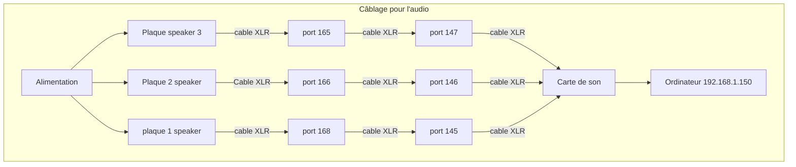

# Diffusion
## Description

## Gallerie d'images
* 
* 
* 
* 

## Fonctionnement

### Flux de données et d’interactions

#### Reaper

#### QLC+

#### TouchDesigner

### Synoptique

### Mode d'emploi des lumières

## Logiciels et Scripts

## Gestion des données et des logiciels

### Gestion des logiciels sur deux ordinateurs

### Les différents ports utilisés
| Port  | Fonction                              |
| ----- | ------------------------------------- |
| 10001 | Qlc+                                  |
| 10002 | TouchDesigner - projection sur le sol |
| 10003 | Reaper incluant le premier patch sur Plugdata   |
| 10004 | TouchDesigner - projection sur le mur |
| 10005 | Reaper incluant le deuxième patch sur Plugdata   |
| 10007 | Reaper incluant le troisième patch sur Plugdata   |
