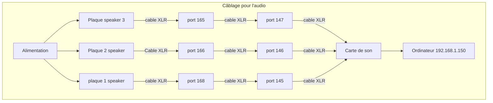

# Diffusion

## Gallerie d'images
* 
* 
* 
* 

## Vidéo

## Documentation vidéo de l'installation en action

## Manuel d'instruction pour opération

### Flux de données et d’interactions

#### Reaper

#### QLC+

#### TouchDesigner

### Synoptique

flowchart TD
    subgraph Câblage_pour_les_Chauvet_eve_e100z
        N[Alimentation] --> O[Plaque 1 Chauvet]
        O -->|câble XLR| P[Port 64]
        N --> R[Plaque 2 Chauvet]
        R -->|câble XLR| O
        O -->|câble XLR| T[Plaque 3 Chauvet]
        T -->|câble XLR| P
        P -->|câble XLR| F[Ordinateur 192.168.1.150]
    end

### Mode d'emploi des lumières
**Association des lumières**

*Associer les lumières une à la fois

*Un channel par lumière

Choisir un channel spécifique et allumer la lumière. Dans les 10 prochaines secondes, cliquer trois fois sur le bouton set du transmetteur. La lumière devrait clignoter 3 fois en vert pour démontrer son association.

Pour une seconde lumière, éteindre la première lumière déjà associée et changer de channel sur le transmetteur. Maintenant, allumer la deuxième lumière et refaire le même processus que fait précédemment sur la première lumière.

**Disassociation des lumières**

Éteindre les lumières et les rallumer. Dans les 5 prochaines secondes, appuyer 5 fois sur le bouton set du transmetteur. Les lumières devraient clignoter 10 fois en rouge pour démontrer leur dissociation du transmetteur.

## Logiciels et Scripts

## Gestion des données et des logiciels

### Gestion des logiciels sur deux ordinateurs

### Les différents ports utilisés
| Port  | Fonction                              |
| ----- | ------------------------------------- |
| 10001 | Qlc+                                  |
| 10002 | TouchDesigner - projection sur le sol |
| 10003 | Reaper incluant le premier patch sur Plugdata   |
| 10004 | TouchDesigner - projection sur le mur |
| 10005 | Reaper incluant le deuxième patch sur Plugdata   |
| 10007 | Reaper incluant le troisième patch sur Plugdata   |
