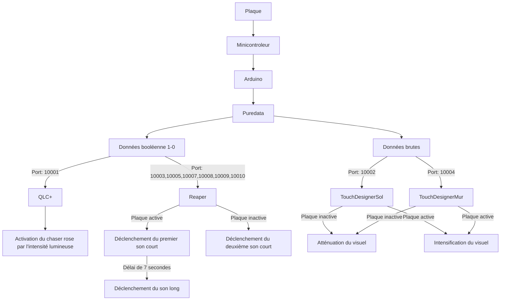
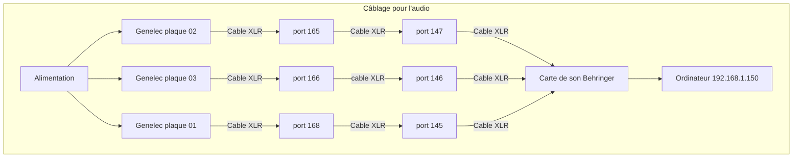
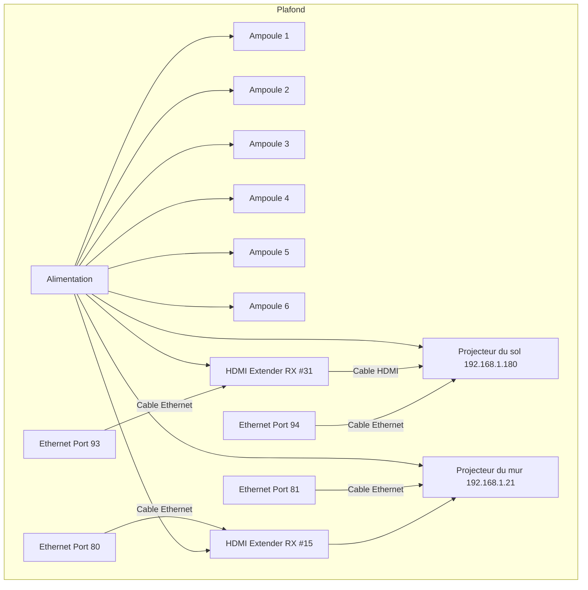
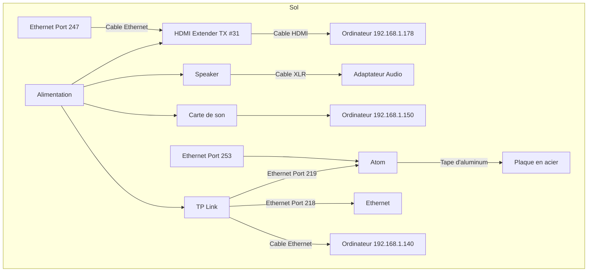
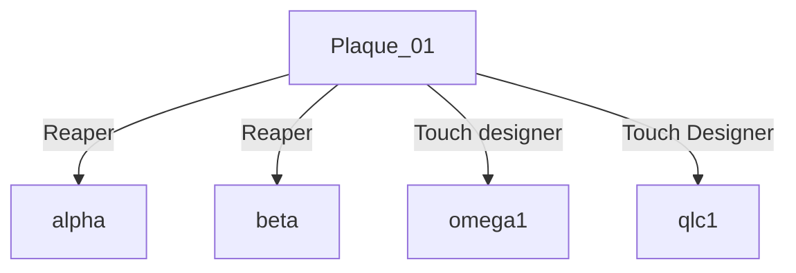
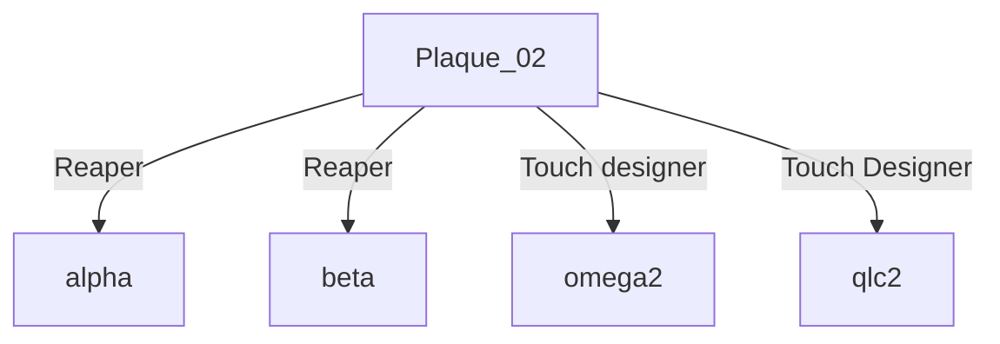
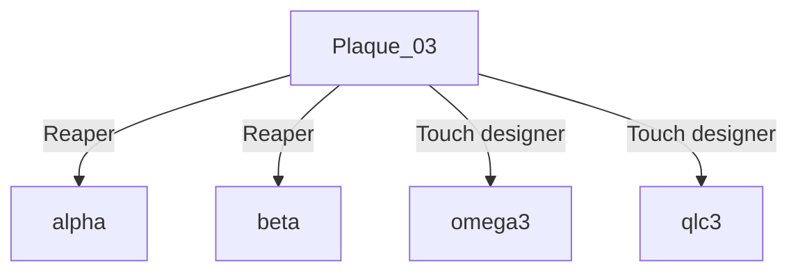

# Diffusion

## Gallerie d'images
* 
* 
* 
* 
* 
* 
* 
* 
* 

## Documentation vidéo

<iframe width="560" height="315" src="https://www.youtube.com/embed/Jz4wxeXT_2w" title="YouTube video player" frameborder="0" allow="accelerometer; autoplay; clipboard-write; encrypted-media; gyroscope; picture-in-picture" referrerpolicy="strict-origin-when-cross-origin" allowfullscreen></iframe>

## Documentation vidéo de l'installation en action

## Manuel d'instruction pour opération

### Gestion des logiciels sur deux ordinateurs

Ordinateur 1 (PC):
* QLC+
* Reaper avec Plugdata
* TouchDesigner (Projection au mur)

Ordinateur 2 (Ordinateur portable):
* Arduino
* Pure Data
* Touch Designer (Projection au sol)
  
## Salle des matrice (caché des utilisateurs)

### Les différents ports utilisés
| Port  | Fonction                                        |
| ----- | ----------------------------------------------- |
| 8001  | Atom M5 Stack 1                                 |
| 8002  | Atom M5 Stack 2                                 |
| 8003  | Atom M5 Stack 3                                 |
| 10001 | QLC+                                            |
| 10002 | TouchDesigner - projection au sol               |
| 10003 | Reaper avec le premier patch sur Plugdata       |
| 10004 | TouchDesigner - projection sur le mur           |
| 10005 | Reaper avec le deuxième patch sur Plugdata      |
| 10007 | Reaper avec le troisième patch sur Plugdata     |
| 10008 | Reaper avec les données des plaques 01 (climax) sur Plugdata     |
| 10009 | Reaper avec les données des plaques 02 (climax)  sur Plugdata     |
| 10010 | Reaper avec les données des plaques 03 (climax) le troisième patch sur Plugdata     |

### Audio 

| Haut-parleurs      | Carte de son (sortie) |
| ------------------ | --------------------- |
| Genelec plaque 01  | 05                    |
| Genelec plaque 02  | 06                    |
| Genelec plaque 03  | 03                    |

#### Reaper

Effets sonores pour la plaque 1
* Magie
* Ruisseau
* Sons aléatoire début
  * Bambo
  * Echo
  * GardenChime
  * Pad méditation
* Sons aléatoire fin
  * Grenouille-01
  * Cloche
  * Hibou

Effets sonores pour la plaque 2
* Tambour
* Méditation
* Sons aléatoire début
  * Flute
  * Flute célestiale
  * Flute célestiale 2
  * UpLifting 2
* Sons aléatoire fin
  * Vent
  * Feuilles
  * Grenouille-01

Effets sonores pour la plaque 3
* Magie 02
* Oiseaux
* Sons aléatoire début
    * Echo
    * Pad méditation
    * UpLifting
    * GardenChime
* Sons aléatoire fin
    * Grenouille-01
    * Libellule
    * Grenouille-02

#### Configuration de base de Reaper

#### Ambiance 

#### Ambiance Stéreo

#### Plaque 1

#### Plaque 2

#### Plaque 3

#### Compression 

#### Master

#### Plug Data

Plaque 1

| Sons     | Note midi |
| -------- | --------- |
| Magie | 60  |
| Ruisseau | 62  |
| Grenouille-01 | 64  |
| Cloche | 65   |
| Hibou | 67  |
| Bambo | 84  |
| Echo | 86  |
| GardenChime | 88   |
| Pad méditation |89  |

Plaque 2

| Sons     | Note midi |
| -------- | --------- |
| Tambour | 60  |
| Méditation | 62  |
| Grenouille-01 | 64  |
| Feuilles | 65   |
| Vent | 67  |
| Flute | 91  |
| Flute-célestiale | 92  |
| Flute célestiale 02 | 94   |
| UpLifting 02 | 95  |

Plaque 3

| Sons     | Note midi |
| -------- | --------- |
| Magie-02 | 60  |
| Oiseaux | 62  |
| Grenouille-02 | 64  |
| Libellule | 65   |
| Grenouille-01 | 67  |
| Echo | 88  |
| Pad meditation | 86  |
| UpLifting | 89   |
| GardenChime | 91  |

Gouttes d'eau pour les 3 plaques

| Sons     | Note midi |
| -------- | --------- |
| Goutte-03 | 72  |
| Goutte-04 | 74  |
| Goutte-05 | 76  |
| Goutte-06 | 77   |

### Lumières

**Association des lumières**

## Associer les lumières une à une

- Un canal par lumière.

1. Choisir un canal spécifique et allumer la lumière. Dans les 10 secondes suivantes, cliquer trois fois sur le bouton "set" du transmetteur. La lumière devrait clignoter trois fois en vert pour indiquer son association.

2. Pour associer une deuxième lumière :
   - Éteindre la première lumière déjà associée.
   - Changer de canal sur le transmetteur.
   - Allumer la deuxième lumière et répéter le même processus que pour la première lumière.

## Dissociation des lumières

1. Éteindre les lumières et les rallumer.
2. Dans les 5 secondes suivantes, appuyer cinq fois sur le bouton "set" du transmetteur. Les lumières devraient clignoter dix fois en rouge pour indiquer leur dissociation du transmetteur.

| Ampoules    | Canaux   |
| ----------- | -------- |
| Ampoule 01  | Canal 01 |
| Ampoule 02  | Canal 02 |
| Ampoule 03  | Canal 03 |
| Ampoule 04  | Canal 04 |
| Ampoule 05  | Canal 05 |
| Ampoule 06  | Canal 06 |

#### QLC+

| Universe   | Lumières              | USB DMX |
| ---------- | --------------------- | ------- |
| Universe 1 | Ampoule DMX 512 RGB   | DMX Output 1 - (S/N 6A009218)    |
| Universe 2 | Lumière generic dimer | DMX Output 1 - (S/N 6A009219)  |

Universe 1

| Lumière        | Adresse    |
| -------------- | ---------- |
| Generic RGBW 1 | 001 - 005  |
| Generic RGBW 2 | 006 - 0010 |
| Generic RGBW 3 | 011 - 015  |
| Generic RGBW 4 | 016 - 020  |
| Generic RGBW 5 | 021 - 025  |
| Generic RGBW 6 | 026 - 030  |

Universe 2

| Lumière   | Adresse |
| --------- | ------- |
| Dimmers 1 | 001     |
| Dimmers 2 | 002     |
| Dimmers 3 | 003     |

Virtual Console

| Slider | Input channel |
| ------ | ------------- |
| Rose   | 1957          |
| Bleu   | 64162         |
| Jaune  | 21930         |
| Vert   | 7907          |
| Mauve  | 15909         |
| Rouge  | 49812         |
| Climax | 45760         |
| Light 1 | 48632       |
| Light 2  | 36717       |
| Light 3 | 40678        |

### Visuel

#### Câblage des projections

#### TouchDesigner

## Effets visuels pour toutes les plaques

### Projection du mur
- Deux des 6 particules GPU passent de 10 particules à 500 quand l'une des plaques est touchée.
- Le gamma devient de plus en plus fort quand la surface des mains augmente.
- Toutes les particules GPU passent au mauve quand la plaque 1 et la plaque 2 sont activées.
- Toutes les particules GPU passent au vert quand la plaque 2 et la plaque 3 sont activées.
- Toutes les particules GPU passent au rouge quand la plaque 1 et la plaque 3 sont activées.
- Toutes les particules GPU changent de couleur (mauve, vert, rouge, rose, bleu, jaune) par intervalle quand toutes les plaques sont activées.
- Quand toutes les plaques sont activées, le vent des particules GPU se met en mouvement grâce à des LFOs.

# Effets visuels pour la plaque 1

## Projection du sol
- Les particules GPU passent d'une force qui se concentre au centre à une force qui se concentre vers la plaque 1 (centre).

## Projection du mur
- Toutes les particules GPU passent au rose quand la plaque 1 est activée.

# Effets visuels pour la plaque 2

## Projection du sol
- Les particules GPU passent d'une force qui se concentre au centre à une force qui se concentre vers la plaque 2 (gauche).

## Projection du mur
- Toutes les particules GPU passent au bleu quand la plaque 2 est activée.

# Effets visuels pour la plaque 3

## Projection du sol
- Les particules GPU passent d'une force qui se concentre au centre à une force qui se concentre vers la plaque 3 (droite).

## Projection du mur
- Toutes les particules GPU passent au jaune quand la plaque 3 est activée.

### Interactivité

#### Arduino

| Port | Fonction        | ID  |
| ---- | --------------- | --- |
| 8001 | Atom M5 Stack 1 | 01  |
| 8002 | Atom M5 Stack 2 | 02  |
| 8003 | Atom M5 Stack 3 | 03  |

#### Pure Data

