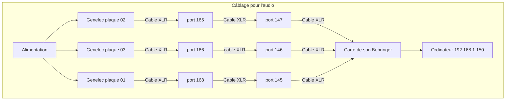
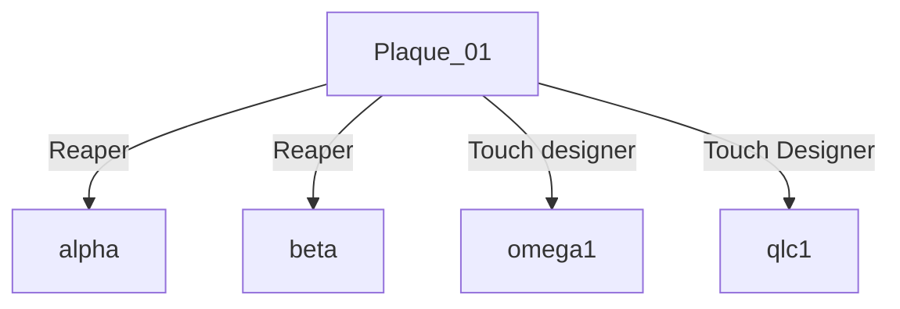
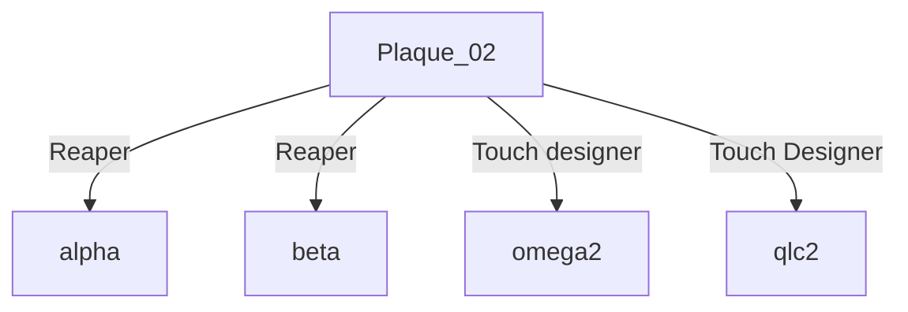
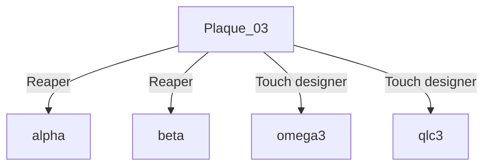

# Diffusion

## Gallerie d'images
* 
* 
* 
* 

## Vidéo

## Documentation vidéo de l'installation en action

## Manuel d'instruction pour opération

### Gestion des logiciels sur deux ordinateurs

Ordinateur 1 (PC):
* QLC+
* Reaper avec Plugdata
* Touch Designer (Projection au mur)

Ordinateur 2 (Ordinateur portable):
* Arduino
* Puredata
* Touch Designer (Projection au sol)

### Les différents ports utilisés
| Port  | Fonction                                        |
| ----- | ----------------------------------------------- |
| 8001  | Atom M5 Stack 1                                 |
| 8002  | Atom M5 Stack 2                                 |
| 8003  | Atom M5 Stack 3                                 |
| 10001 | Qlc+                                            |
| 10002 | TouchDesigner - projection sur le sol           |
| 10003 | Reaper incluant le premier patch sur Plugdata   |
| 10004 | TouchDesigner - projection sur le mur           |
| 10005 | Reaper incluant le deuxième patch sur Plugdata  |
| 10007 | Reaper incluant le troisième patch sur Plugdata |

### Audio 

| Haut-parleurs     | Carte de son (sortie) |
| ----------------- | --------------------- |
| Genelec plaque 01 | 05                    |
| Genelec plaque 02 | 06                    |
| Genelec plaque 03 | 03                    |

#### Reaper

Effets sonores pour la plaque 1
* Magie
* Ruisseau
* Sons aléatoire
  * Grenouille-01
  * Cloche
  * Hibou

Effets sonores pour la plaque 2
* Tambour
* Méditation
* Sons aléatoire
  * Vent
  * Feuilles
  * Grenouille-01

Effets sonores pour la plaque 3
* Magie 02
* Oiseaux
* Sons aléatoire
    * Grenouille-01
    * Libellule
    * Grenouille-02

#### Plug Data

Plaque 1

| Sons     | Note midi |
| -------- | --------- |
| Magie | 60  |
| Ruisseau | 62  |
| Grenouille-01 | 64  |
| Cloche | 65   |
| Hibou | 67  |

Plaque 2

| Sons     | Note midi |
| -------- | --------- |
| Tambour | 60  |
| Méditation | 62  |
| Grenouille-01 | 64  |
| Feuilles | 65   |
| Vent | 67  |

Plaque 3

| Sons     | Note midi |
| -------- | --------- |
| Magie-02 | 60  |
| Oiseaux | 62  |
| Grenouille-02 | 64  |
| Libellule | 65   |
| Grenouille-01 | 67  |

Gouttes d'eau pour les 3 plaques

| Sons     | Note midi |
| -------- | --------- |
| Goutte-03 | 72  |
| Goutte-04 | 74  |
| Goutte-05 | 76  |
| Goutte-06 | 77   |

### Lumières

**Association des lumières**

*Associer les lumières une à la fois

*Un channel par lumière

Choisir un channel spécifique et allumer la lumière. Dans les 10 prochaines secondes, cliquer trois fois sur le bouton set du transmetteur. La lumière devrait clignoter 3 fois en vert pour démontrer son association.

Pour une seconde lumière, éteindre la première lumière déjà associée et changer de channel sur le transmetteur. Maintenant, allumer la deuxième lumière et refaire le même processus que fait précédemment sur la première lumière.

**Disassociation des lumières**

Éteindre les lumières et les rallumer. Dans les 5 prochaines secondes, appuyer 5 fois sur le bouton set du transmetteur. Les lumières devraient clignoter 10 fois en rouge pour démontrer leur dissociation du transmetteur.

| Ampoules   | Canal    |
| ---------- | -------- |
| Ampoule 01 | Canal 01 |
| Ampoule 02 | Canal 02 |
| Ampoule 03 | Canal 03 |
| Ampoule 04 | Canal 04 |
| Ampoule 05 | Canal 05 |
| Ampoule 06 | Canal 06 |

#### QLC+

| Universe   | Lumières              | USB DMX |
| ---------- | --------------------- | ------- |
| Universe 1 | Ampoule DMX 512 RGB   | ...     |
| Universe 2 | Lumière generic dimer | ...     |

Universe 1

| Lumière        | Adresse    |
| -------------- | ---------- |
| Generic RGBW 1 | 001 - 005  |
| Generic RGBW 2 | 006 - 0010 |
| Generic RGBW 3 | 011 - 015  |
| Generic RGBW 4 | 016 - 020  |
| Generic RGBW 5 | 021 - 025  |
| Generic RGBW 6 | 026 - 030  |

Universe 2

| Lumière   | Adresse |
| --------- | ------- |
| Dimmers 1 | 001     |
| Dimmers 2 | 002     |
| Dimmers 3 | 003     |

Virtual Console

| Slider | Input channel |
| ------ | ------------- |
| Rose   | 1957          |
| Bleu   | 64162         |
| Jaune  | 21930         |
| Vert   | 7907          |
| Mauve  | 15909         |
| Rouge  | 49812         |
| Climax | 45760         |

### Visuel

#### TouchDesigner

### Interactivité

#### Arduino

| Port | Fonction        | ID  |
| ---- | --------------- | --- |
| 8001 | Atom M5 Stack 1 | 01  |
| 8002 | Atom M5 Stack 2 | 02  |
| 8003 | Atom M5 Stack 3 | 03  |

#### Pure Data

